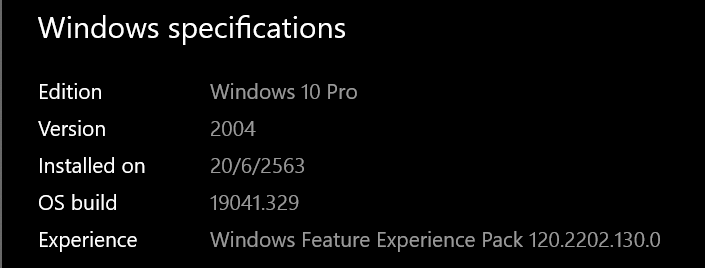
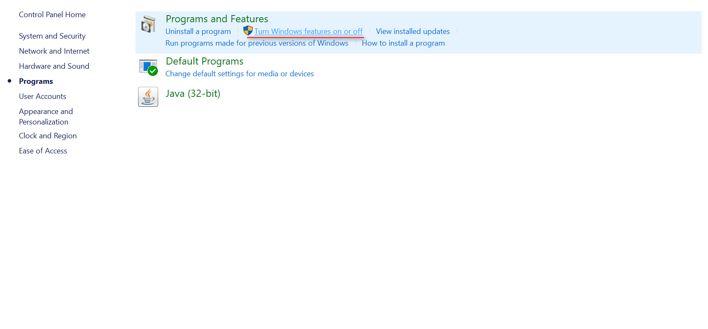
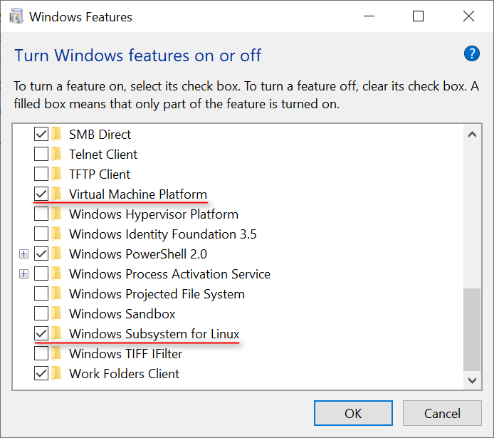
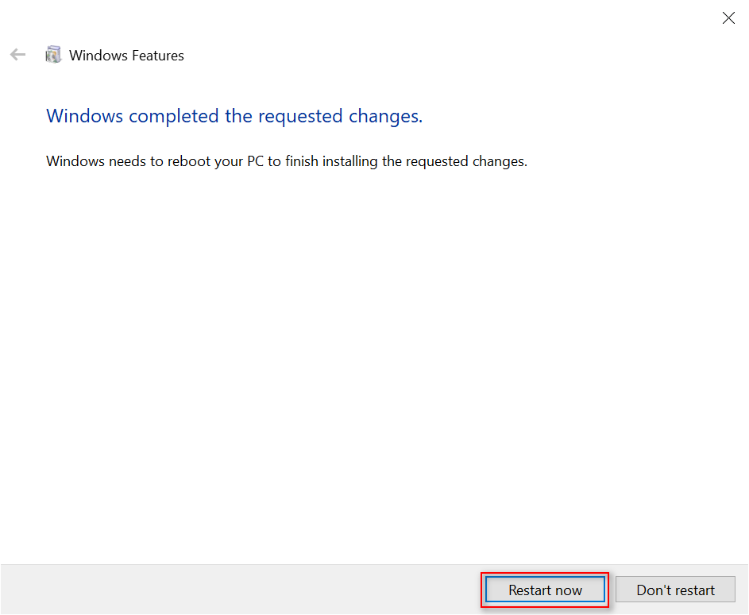
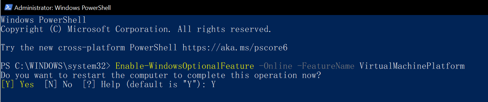
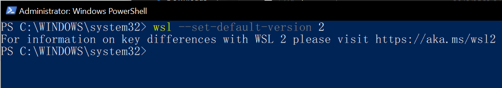
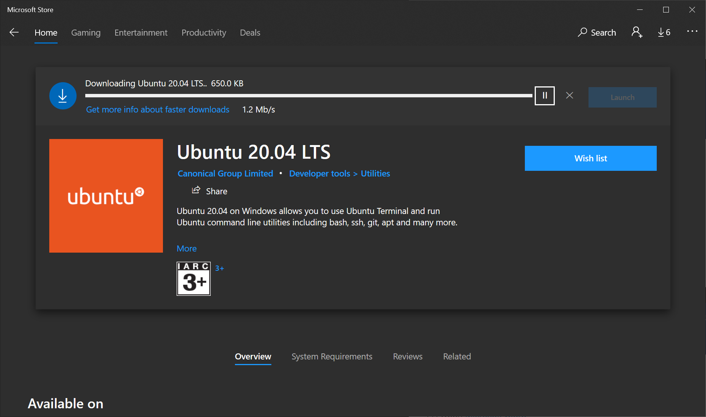
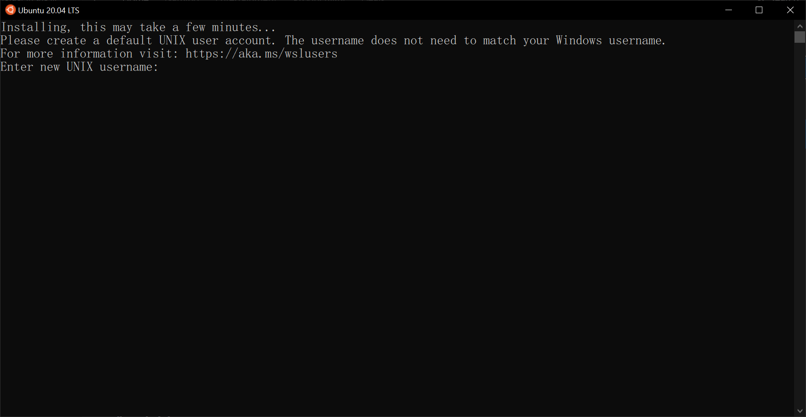
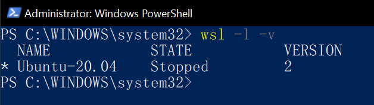
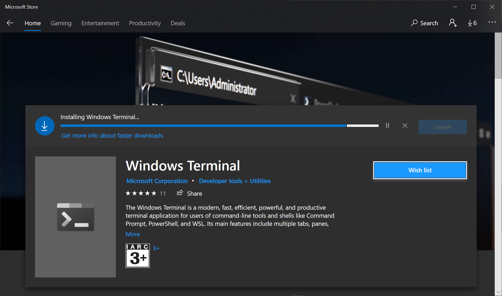

# Windows Subsystem for Linux (2) Installation Guide for Windows 10

## Windows Version (2004)


## Enable Windows Subsystem for Linux (WSL)



<h4>Restart Windows</h4>



### OR
## Enabling Virtual Machine Platform
<h4> Power Shell (Admin)</h4>



<h4>Restart Windows</h4>

---

# WSL2 
## Install WSL2 Kernel
(1) Download [WSL2 Kernel](https://wslstorestorage.blob.core.windows.net/wslblob/wsl_update_x64.msi)

(2) Power Shell (Admin) and Run
```
wsl --set-default-version 2
```


## Install your Linux distribution
(1) Open [Microsoft Store](https://aka.ms/wslstore)

(2) Search and install Ubuntu


## Set up a new distribution
<h4>Create user and password for your new linux </h4>



## Show Version distro


## Windows Terminal


## Terminal


## References
> https://pureinfotech.com/install-windows-subsystem-linux-2-windows-10/

> https://docs.microsoft.com/en-us/windows/wsl/install-win10

> https://docs.microsoft.com/en-us/windows/wsl/wsl2-kernel
